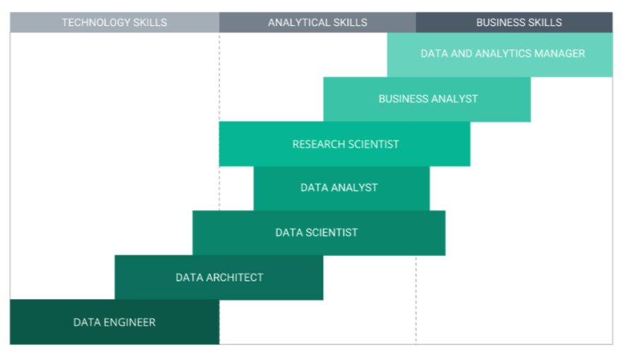
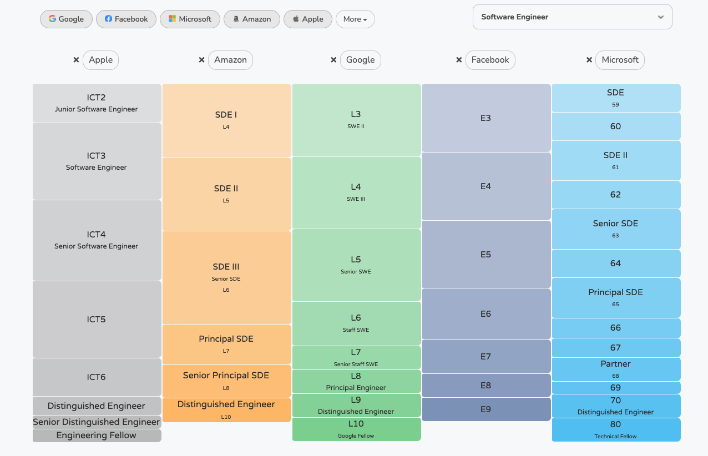

# Lecture 10: Additional Topics

## Career Workshop
### Different type of companies
- 

### Why did I choose the tech industry?
- a variety of problems to solve 
    - finance vs. the rest of the world (and fin-tech)
- my skillset was a good fit
    - And probably yours as well
    - Easy: python, SQL, coding in general, 
    - Harder: business intuition (this is pretty vague, but you have to be good at it)
- in general, makes good 💵💵💵
- good work-life balance
    - YOU CAN WORK FROM HOME!
    - free meals 🍔
    - free ice-cream 🍦
    - free massage 💆‍♂️
    - free child-care 🧒
    - bring your pets to work 🦮
    - Unlimited vacation 🏖
- more options
    - skill sets you’ll learn are very transferrable
    - Finance people tend to stick within Finance, otherwise, experience /= 2
    - From tech to finance -- doable, I see a lot of success stories, people can liquidate $$$ quickly
        - Easier to get eng roles, harder to get QR roles (usually PhD or Google brain, FAIR)
    - From finance -> tech -- kind of not okay, but you are kind of stuck.
    - start-up, mid-size, large-size — there is always something that fit your risk appetite

### Different stages of a tech company
- 

### Maslow triangle of ML
- 

## Data scientist spectrum 
- 

## Different stages, different needs
- **Early-stage startup**
    - 0 -> 0, 0 -> 0, 0-> 0 (X100), 0->1
    - product and business model failure rates are high (e.g., Thomas Edison’s light bulb)
    - no infrastructure at all
        - not quite true — a lot of IaaS, PaaS, SaaS tools available right now (e.g., AWS, GCP)
            - IaaS -- AWS
            - PaaS -- paypal, DataBricks 
            - SaaS -- logging service -- datadog, 
    - less data  => less insight available => no need for pure DS (unless it’s an AI start-up, like OpenAI)
    - As a DS, you are also
        - a Product Manager
            - you need to figure out what to do
        - a Data Engineer
            - you need to get the data yourself
        - a Backend Engineer
            - you need to ship your code to production
        - a Frontend Engineer
            - you need to build some dashboards
    - you are probably the only DS => you figure things out
    - you have a problem to solve (either you figure it out, or the CEO tells you), and it will be either
        - unsolvable, so you find another problem to solve and repeat, or
        - solved by linear/logistic regression with a decent result
            - Decent is enough here because there are other lower-hanging fruits for you to do than trying a neural net model
    - pros
        - you will learn a lot, and you will have a lot of options for your career
        - the easiest way to become a [b|m]illionaire, % ver low, a lot of luck
    - cons
        - you will become a “jack of all trades” (maybe a pro?)
        - you will learn things the hard way (comparing to Google, where everything has a playbook)
        - base salary, in general, is lower, equities are illiquid
- **Growth stage**
  - 20% -> 80%
  - business model and products are usually proved valuable 
  - okay infrastructure, focus on scale (e.g., how to build a database that supports 10x of the current load)
  - As a DS, sometimes, you are also
    - ML engineer
      - you still need to bring your code to production
    - DS will usually be a team of ~10 people, so you have a lot of learning opportunities and someone will guide you on how to do things
    - The company has collected enough data for you to try advanced ML models
    - you a problem to solve (your manager tells you)
        - usually, a prototype is ready — someone built an LR model when the company was young
        - you need to improve the model, using more data and more advanced techniques
    - Pros
      - your role is well-defined, career trajectory (i.e., the ladder) is clear
      - Compensation structure is similar to Giant companies with more upside (and downside)
    - Cons
      - Still low chance to learn & do cutting edge ML
      - Still very likely to become a “jack of all trades”
      - Hard to get back to Giant companies (skillsets not really transferrable)
- **Mature stage**
  - 80% -> 100%
  - Everything is very well-defined
  - what you are trying to optimize (i.e., the metrics) is usually far away from the business
  - Great infrastructure, you can do cutting edge ML there
  - You will be one of…
    - Data Analyst/Data Scientist
      - usually a lot of SQLs, some ML, a lot of experimentation (i.e., A/B test)
    - ML Engineer/Research Scientist
      - a lot of deep learning & coding (e.g., Google Brain, FAIR)
      - A lot of these roles requires a PhD
  - Pros
    - good work-life balance
    - great comp
    - very clear expectation and growth trajectory (but not fast)
    - great learning opportunities, as everything has a playbook
    - also, you will be using the most cutting edge technologies
  - Cons
    - You either do a lot of cutting edge ML (and thus compete with CS PhDs) or no ML at all
    - hard to see the big picture, especially for junior positions
    - company politics will be inevitable

### Career trajectory and $$$
- Career Ladder
    - In finance: analyst (t3) -- associate (t4) -- vp (t5 ~5yr) -- director (t6~t7) -- head of XXX -- Partner...
        - 
- Comp structure
    - total comp = base salary ($$) + equities (stock/rsu/option) + bonus (anything)
        - base salary
            - usually higher than finance companies for junior positions
        - equities
            - Equities (for IPO companies), RSU (pre-IPO), options (call options) depend on the stage of the companies
                - Equity = RSU
                - Option has more upside
                    - S = 10, K =5 (option = $5)
                    - When S*=2 (RSU just 2x, but option get 3x)
            - you’ll know how much you’ll be getting for the first 4 years when you get the offer
                - Google offer -- 100k base + $200k equity vested 4 year ⇒ your first year salary = 100k + 200k/4 = 150k + ??bonus
            - typically, 1-year cliff
        - bonus
            - cash + equity refresh
            - cash
                - very little, like 10% of your base
            - equity refresh
                - small amount, vested 4 years
            - In tech company, your comp will be maxed out ~year 3~4
- Examples
    - https://www.levels.fyi/
    - Top hedge fund (300k) >> tech (150~180) >> regular finance industry (150 total)
    
### Skill Set required
- 
- Mathematics and Statistics Skills
    - You all have it
    - Maybe focus on experimentation if you will do A/B testing (hypothesis testing)
    - Maybe focus on econometrics (MFE 230E) if you will be doing forecasting
    - As long as you know how to do expectation, bayes rules, should be good enough
- **Essential Programming Skills**
    - I think this is a strong weakness MFE students tend to have
    - MFE bar is getting higher on this
        - They ask you to learn python before coming to the program
            - But knowing how to code != good at coding != good at algo
            - Good at coding == being able to code in a production environment
                - Modular code (use classes, use functions instead of A 500-line function)
                - Unit test -- you should test your code
                - Naming of variable 
                - `clean code` is a good book to practice good coding skills
                - ^^^ this is pretty high bar
                - But not good enough to write production-level code (would be hard to be an ML Eng)
- Data Wrangling and Preprocessing Skills
    - Use SQL and/or Pandas to get the data in the format you want
    - I think you guys should be very easily good at it
    - try [this book](https://www.amazon.com/Python-Data-Analysis-Wrangling-IPython/dp/1449319793)
- Data Visualization Skills
    - A graph is worth a thousand words
    - Can you tell a compelling story?
    - Not essential (b/c this question will not appear in interviews)
    - Know how to use matplotlib, or BI tools (mode, looker, tableau, etc.)
- Basic Machine Learning Skills
    - Depends on what lifecycle of company you want to get in
    - Younger
        - Be good at Sklearn framework should be good enough
    - Mature
        - Need to know some NN stuffs
    - All learnable from Coursera, Udacity, Udemy, etc...
- Skills from Real World Capstone Data Science Projects
    - Very important -- this could differentiate you vs. others
    - Kaggle Projects
        - Won’t recommend doing too much, b/c it’s kind of misleading
            - It’s misleading b/c they prepare the dataset for you
            - In real life, you will spend >50% cleaning data
        - Good opp to learn cutting edge MLs
    - Internships
        - The best way, but you need to get an internship first
    - MFE Projects
        - Good opp, not sure how this year goes
    - From Interview
- Communication Skills, Lifelong Learning Skills, Team Player Skills, Ethical Skills
    - Important soft skills, probably not essential to get a job offer, but important for career advancement
    

### How to get an offer?
- 
- funnel method
    - resume -> recruiter -> recruit phone screen -> technical phone screen -> on-site -> offer -> take it
- what's wrong with your funnel? and how to fix your funnel
    - resume -> recruiter
        - don't know where to send the resume?
            - head hunter via linkedin
            - referral (cold/hot)
                - Cold -- asking random people on linkedin to refer you
                    - Think is actually fine, b/c people are very happy to do that, b/c if you get an offer, they get paid!
                    - The only reasons a person won’t do
                        - He is rich enough
                        - He doesn’t think your resume will pass
                            - This is a good feedback loop to improve your resume
            - online application
                - Go directly to the company website 
            - campus career fair -- only for junior position
        - Area of improvement
            - You can improve % (polish your resume)
                - Keyword, each bullet points on your resume should tell a story of “I did X using Y, achieving Z result”, where Z = a number
                - Buzzwords matter -- ML, NN, NLP, LSTM, RF, ....
            - You can improve your exposure (knowing more people, networking)
    - recruiter -> recruiter phone screen
        - didn't pass the filter
            - resume not polished?
                - buzz words are very important
                - numbers are very important
                - what you did -> what technology you use -> what impact you contribute
            - don't have a lot of stuff to put into your resume?
                - consider taking some online classes
                - consider doing more MFE projects
        - how to increase the % passing?
            - channels are very important
                - hot referral ~= cold referral >= head hunter >= campus career fair ~= online application (the biggest N)
    - recruiter phone screen -> technical phone screen
        - I think you guys should achieve 90%+ at this
            - If not your communication skill is a problem
        - recruiter phone screen
            - fit, the buzz word
        - how to increase the % passing?
            - Prepare, understand company business models, and sell yourself well
    - phone screen -> on-site
        - you can prepare
            - Leetcoding, ML algo, pandas, unit test, sql, …
        - try to find some sample questions online
            - Glassdoor, classmate, 1point3arc.com (in Chinese), ask Linda, ask Frank, etc.
        - a great feedback loop to figure out where you should spend time on
        - how to improve %?
            - a lot of practicing
            - the lowest %, the highest ROI
    - on-site -> offer
        - if you can do phone screens well, this should be easy.
        - questions are in general harder.
        - testing areas:
            - technicality
                - coding
                - modeling 
                - stats
            - business intuition
                - !!! very important !!!
                - could be a deal-breaker
                - takes time to be good at this
                - this is very different from the Finance industry
            - culture fit
                - how do you fit into the company/team's core value
        - how to improve %?
            - practice 
            - communication is very important
            - especitally English is not your first language
    - offer -> take it
        - negotiation matters
        - not covering today
        - Linda does a better job than me
- how's my funnel look like?
    - upon graduation
        - resume -> recruiter: low. as I don't have a lot of connections and don't know how to expand that 
        - recruiter -> recruiter phone screen: 100%.
        - recruiter phone screen -> technical phone screen: 100%
        - phone screen -> on-site: ~50%: either aced it or completely didn't know how I fail
        - on-site -> offer: 80%: I was technically strong.
        - offer -> job: wasn't good at negotiation
    - 3yr in the tech industry
        - resume -> recruiter: okay. I know a lot of people, can get my resume to deliver to most of the companies.
        - recruiter -> recruiter phone screen: 75%: specialty makes me harder to fit some roles
        - recruiter phone screen -> technical phone screen: 100%
        - phone screen -> on-site: 90%: practice makes perfect
        - on-site -> offer: 80% -- each stage requires different skillsets, need to get better to keep the %
        - offer -> job: a better negotiator
    - what's changed?
        - sit at the other side of the table (interviewing others) helps
        - once getting into the tech industry, easier to transit
    - rules of thumb:
        - 100 recruiter -> 50 phone interview -> 10 onsite -> 1 offer

### Frank's personal final tips for MFE 2023
- 230E is the most important class
- there are trade-offs everywhere
    - GPA vs sleep vs romance vs projects
    - You are NOT expected to do well in every class
        - no one look at your GPA!
    - Frank's example
        - did a lot of ML-related projects
        - go to gym every day 3pm regardless of what (lecture/GSI session/...)
        - not spending too much time on less relevant class (which I am not going to mention)
        - HW group up -- did more coding part than math part (not recommend)
- take some MOOCs if possible!
- try to extend your internship! 

# Other Topics
## Efficient Python coding
- useful functions write efficient codes
    - `zip`/`enumerate`
    - Lambda functions 
    - list comprehension
    - [pandas chaining](https://tomaugspurger.github.io/method-chaining.html) (vs. not chaining)
        - `.apply`
        - `.assign`
        - `.pipe`
    
# If we still have time
## Model productionalization
- how to productionize model training
- how to do model promotion
- data version vs model version vs code version

